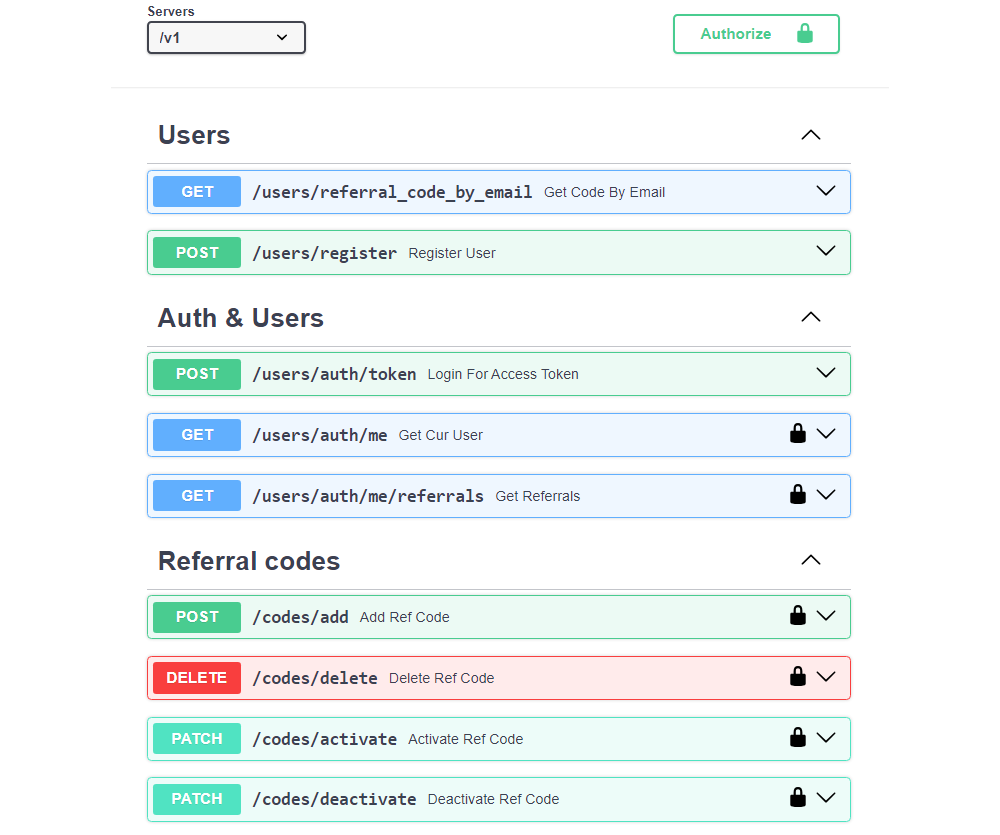

# Описание
**Referral-FastAPI - это сервис реферальной системы.**




## Функционал
- Получение реферального кода по email адресу реферера (без аутентификации);
- Регистрация по email адресу и паролю (реферальный код опционален);
-
- Аутентификация пользователя с помощью `JWT` и `Oauth 2.0`;
- Получение информации о себе и своих реферальных кодах;
- Получение информации о своих рефералах;
-
- Создание/Удаление своих реферальных кодов;
- Активация/Деактивация своих реферальных кодов;
- У реферальных кодов есть срок годности;
- В один момент времени может быть активен только один код;
-
- При регистрации пользователя по реферальному коду, его рефереру присылается на email уведомление об этом с помощью `celery`.


## Во время разработки
- Асинхронно использовал `SQLAlchemy` для быстрой обработки запросов;
- Внедрил миграции для управления версиями БД с помощью `Alembic`;
- При помощи `Redis` применил кеширование для выдачи кода по email реферера и получения информации о своих рефералах;
- Для написания и выполнения тестов выбрал `Pytest`;
- Применил Docker-Compose для связи нескольких сервисов (`Nginx`, `API`, `Postgres-DB`, `Redis`, `Celery`, `Flower`);
- Настроил `Nginx` для работы на локальном хосте;
- Использовал инструменты для разработки: `PDM`, `Ruff`, `Black`, `isort`.


## Отличия от Booking-FastAPI
https://github.com/Bllagden/Booking-FastAPI
- Использование `JWT` и `Oauth 2.0` (в Booking-FastAPI `JWT` и `cookies`);
- Улучшена работа сессий `SQLAlchemy` (их создание вынесено в отдельную функцию).
- Улучшена структура проекта (добавлены директории `adapters` и `core`);


## Что можно доработать
- Cистему авторизации (сейчас у всех аутентифицированных пользователей одинаковые права);
- Внедрить версионирование API;
- Полностью покрыть тестами.


## Стиль кода
Для форматирования кода используются `Black` и `isort` (с профилем Black).

Для статического анализа кода используется `Ruff`.

`PDM`, кроме работы с зависимостями, позволяет использовать скрипты для автоматизации процессов проверки и форматирования кода.
<br />
Вызов скрипта: `pdm run lint_src`
>Скрипт из `pyproject.toml`:
>
>[tool.pdm.scripts]
><br />
>lint_src = {composite = [
><br />
>"ruff check ./src --fix --show-fixes",
><br />
>"black ./src",
><br />
>"ruff check ./src --fix --show-fixes",
><br />
>"alembic check",
><br />
>]}


## Замена .env файлов
При запуске через `Docker Compose` файл `.env.dev` заменяется на `.env.prod` (настройка docker-compose.yml).

При тестировании файл `.env.dev` заменяется на `.env.test` (с помощью библиотеки `pytest-dotenv`).
>Для этого в `pyproject.toml` добавлено:
>
>[tool.pytest.ini_options]
><br />
>env_files = [".env.test",]

Для запуска тестов из консоли необходимо явно указать `.env` файл:
```
pytest --envfile .env.test -s -v
```


## Создание секретного ключа для JWT
`AUTH_SECRET_KEY` в `.env` файлах 
```
from secrets import token_bytes
from base64 import b64encode

print(b64encode(token_bytes(32)).decode())
```


## Запуск через VS Code
1) Установить:

    [Postgres](https://www.postgresql.org/)
    <br />
    [Redis](https://redis.io/)
    (для [Windows](https://github.com/tporadowski/redis/releases/))
    <br />
    [PDM](https://pdm-project.org/latest/)

2) Склонировать репозиторий:
    ```
    git clone git@github.com:Bllagden/Referral-FastAPI.git
    cd Referral-FastAPI
    ```

3) Установить зависимости:
    ```
    pdm install
    ```

4) Создать .env файлы:
    
    `.env.dev`, `.env.test` и `.env.prod` по аналогии с:
    <br />
    `.env_example.dev`, `.env_example.test` и `.env_example.prod`
    <br />
    (`.env.prod` необязателен)

5) Настройка БД:
    
    Создать `DEV-DB` и `TEST-DB` и вписать настройки для подключения к ним в `.env` файлы.
    
    Находясь в корне `Referral-FastAPI` сделать миграцию по очереди для обеих (использовать для этого `.env.dev`):
    <br />
    ```
    alembic upgrade head
    ```

6) Настройка Celery:

    Включить двухэтапную аутентификацию и создать пароль приложения в настройках Google аккаунта для отправки электронных писем через `Celery`. Добавить пароль приложения и почту в `.env` файлы (SMTP).

7) Запуск:
    
    Запустить `redis-server`;
    
    Открыть `Referral-FastAPI` через VSCode и из `Run and Debug` запустить:
    <br />
     `Referral FastAPI`, `Celery Worker` и `Celery Flower`.

    Настройки находятся в `.vscode/launch.json` (там же есть команды для прямого запуска из командной оболочки).

8) Доступ:
    
    API: http://127.0.0.1:8000/docs
    <br />
    Flower: http://127.0.0.1:5555


## Запуск через Docker
1) Склонировать репозиторий:
    ```
    git clone git@github.com:Bllagden/Referral-FastAPI.git
    cd Referral-FastAPI
    ```

2) Создать .env файлы:
    
    `.env.dev`, `.env.test` и `.env.prod` по аналогии с:
    <br />
    `.env_example.dev`, `.env_example.test` и `.env_example.prod`
    <br />
    (`.env.dev` и `.env.test` необязательны)
    
    
3) Запуск:
    ```
    docker-compose up
    ```

4) Доступ:
    
    API: `http://YOUR_IP/docs`
    <br />
    Flower: `http://YOUR_IP/flower/`


## PgAdmin

Если взять настройки из `.env_examples`:

1) `DEV-DB` (необходимо создать для запуска приложения из VSCode)
    >Host: `localhost`
    ><br />
    >Port: `5432`
    ><br />
    >Main db: `fastapi_referral_dev`
    ><br />
    >Username: `postgres`
    ><br />
    >Password: `postgres`

2) `PROD-DB` (создается сама в докер-контейнере, есть возможность подключиться к ней извне)
    >Host: `YOUR_IP`
    ><br />
    >Port: `5433`
    ><br />
    >Main db: `referral_app`
    ><br />
    >Username: `postgres_user`
    ><br />
    >Password: `postgres_password` *нужен сложный пароль

3) `TEST-DB` (во время тестов заполняется сама данными из mock-файлов; создается также, как и `DEV-DB`, но с другим именем)
    >Main db: `fastapi_referral_test`


